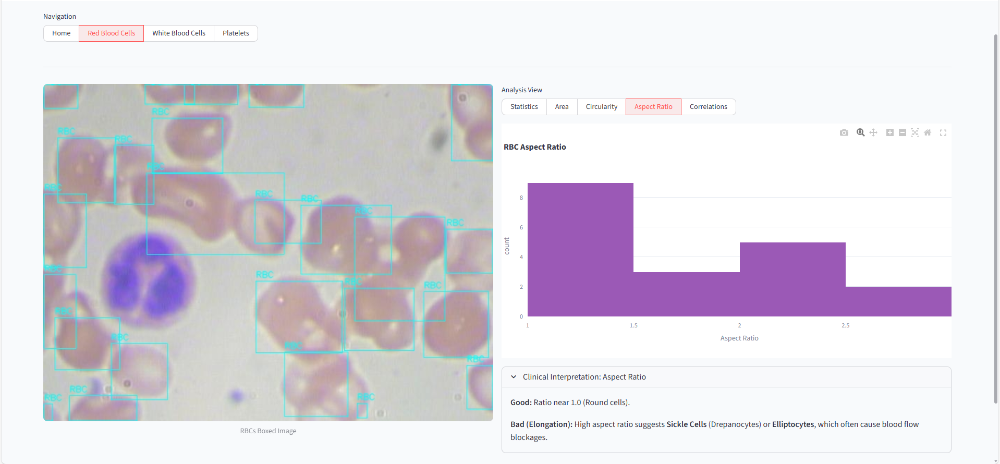
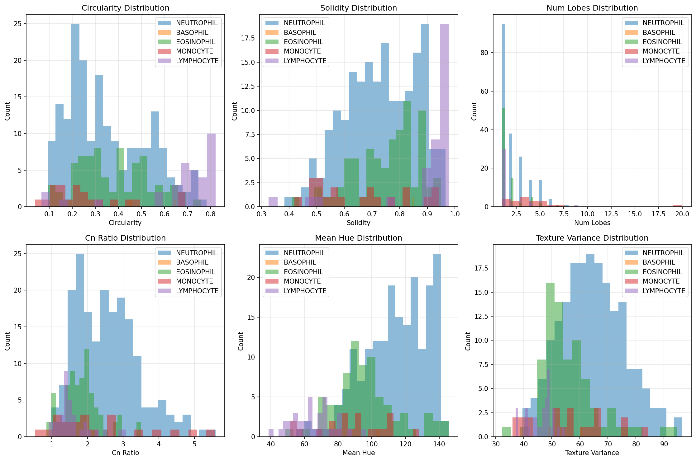
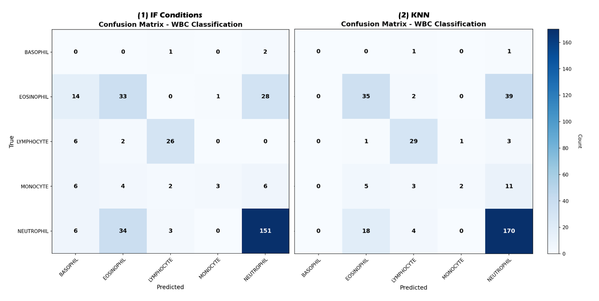
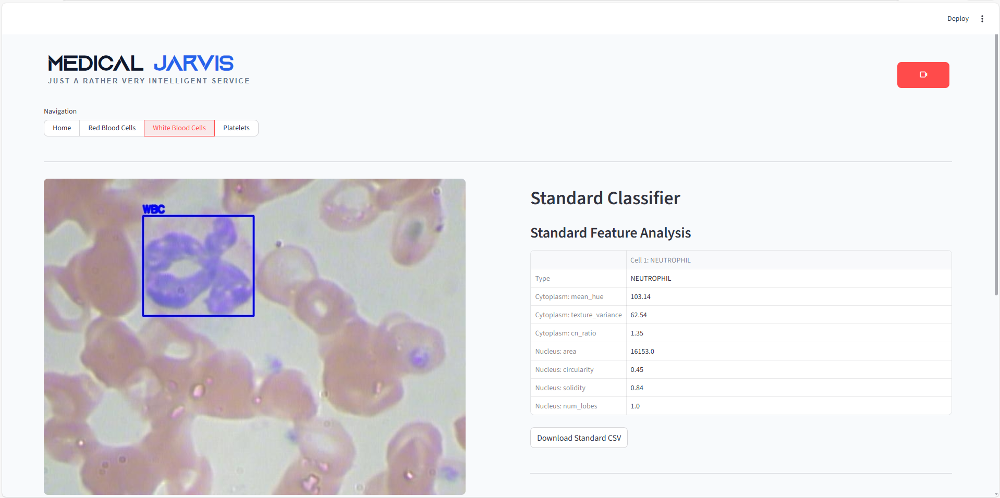
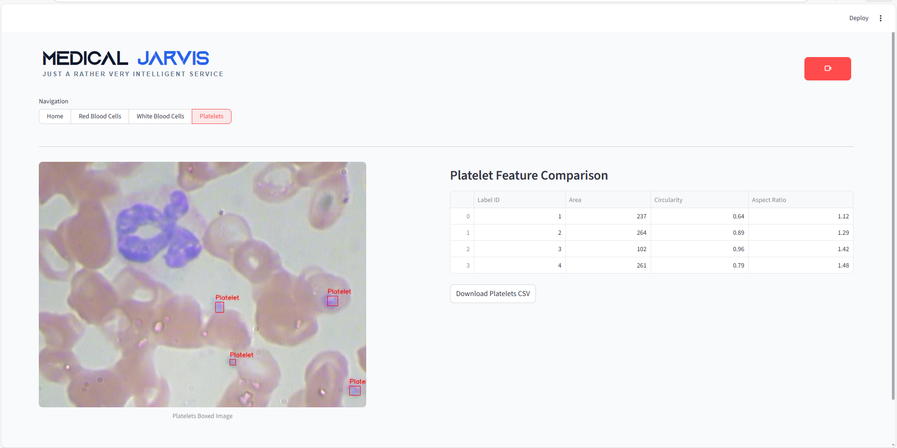
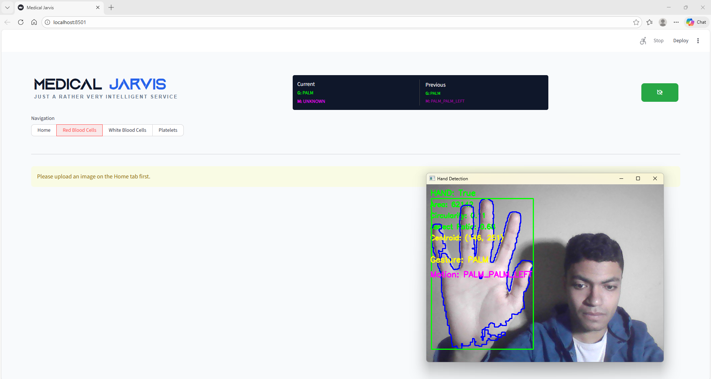

# Jarvis – Blood Cell Analysis & Hand Gesture Interaction

---

## Overview
Jarvis is an integrated computer vision system designed for automated blood smear image analysis and hand gesture-based interaction. It accurately detects, segments, and classifies red blood cells (RBCs), white blood cells (WBCs), and platelets, while enabling hands-free control through hand gestures. This dual functionality supports efficient medical analysis and touchless system control in laboratory environments.

---

## System Architecture
The system pipeline consists of:
1. **Image Preprocessing**: Noise reduction, color space conversion, and morphological filtering.
2. **Cell Segmentation**: RBC segmentation using marker-controlled watershed, WBC and platelet segmentation using color-based thresholding.
3. **Feature Extraction**: Extraction of RBC, WBC, and platelet features for classification and analysis.
4. **Cell Classification**: Rule-based IF conditions and KNN for WBC classification.
5. **Hand Gesture Detection**: Real-time hand detection using YCrCb thresholding, contour analysis, convex hull, and convexity defects.
6. **Gesture Interpretation**: Static gestures (FIST, PALM, POINT) and dynamic gestures (motion detection, direction classification).

---

## Core Features

### Red Blood Cells (RBCs) Segmentation
- **Objective**: Accurately isolate RBC regions, separate touching/overlapping cells, preserve boundaries.
- **Techniques Used**:
  - HSV color-based thresholding
  - Morphological refinement (opening & closing)
  - Distance transform for marker generation
  - Marker-controlled watershed segmentation
  - Hessian-based boundary detection (Frangi filter) - used to enhance the watershed results

*Before vs after preprocessing:*


*Post-Watershed Refinement:*  


_RBC detection using the web app_



### White Blood Cells (WBCs) Classification
- **Segmentation**: HSV thresholding (purple color range), morphological filtering.
- **Feature Extraction**: features including nucleus, cytoplasm, and region metadata.
- **Classification Approaches**:
  - IF Conditions (rule-based)
  - K-Nearest Neighbors (KNN)

*Feature Distribution Plots:*  


*Confusion Matrix:*  


_WBC detection and classification using the web app_


### Platelets Detection
- **Segmentation**: HSV color-based thresholding, morphological operations.
- **Feature Extraction**: Counting platelets in the image.

*Platelets Detection:*  


### Hand Gesture Detection
- **Objective**: Enable intuitive, touchless interaction with the system.
- **Pipeline**:
  - Color space conversion (YCrCb) for skin detection
  - Skin thresholding and Gaussian smoothing
  - Morphological refinement
  - Contour extraction and centroid computation
  - Convex hull and convexity defect analysis
  - Geometric feature extraction (bounding box, area, aspect ratio, circularity)
- **Gesture Classification**:
  - Static gestures: FIST, PALM, POINT, UNKNOWN
  - Dynamic gestures: Motion detection using centroid displacement, direction estimation

*Hand Gestures Demo:*  
[](images/gestures.mp4)

---

## Results & Analysis
- **RBC Segmentation**: separating overlapping cells and preserving boundaries with most of the testcases.
- **WBC Classification**: Achieved per-type accuracies up to 82.68% (Neutrophils) with rule-based classification and overall accuracy 72.62% with KNN.
- **Platelets Detection**: Accurate detection and counting.
- **Hand Gesture Recognition**: 95.3% accuracy for detecting a hand using classical CV methods, comparable to MediaPipe deep learning model.


## Exported Analysis Results
The system allows users to **download a CSV file** containing the extracted features and analysis results for each processed image directly from the UI.  

---

## How to Run the Project
```bash
pip install -r requirements.txt
streamlit run ui/app.py
```

---

## Datasets
The system was developed and evaluated using publicly available blood smear image datasets:

- **BCCD Dataset**: [Kaggle link](https://www.kaggle.com/datasets/surajiiitm/bccd-dataset) — contains **images** of RBCs, WBCs, and platelets.  
- **Blood Cell Images Dataset**: [Kaggle link](https://www.kaggle.com/datasets/paultimothymooney/blood-cells) — contains **both images and labeled annotations**, used for labeling and validation.

---

## 👤 Author

**Ahmed Mohamed**  
📧 [ahmed.mohamed04@hotmail.com](mailto:ahmed.mohamed04@hotmail.com)  
🔗 [LinkedIn Profile](https://www.linkedin.com/in/ahmed04/)


